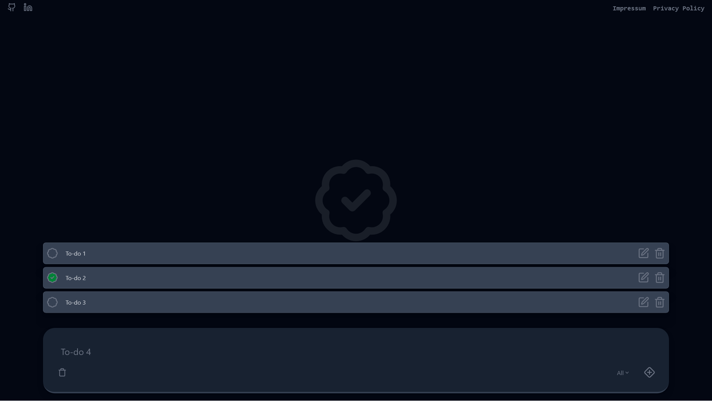

# 📝 React Todo App

A modern, responsive todo application built with React and Tailwind CSS. Manage your tasks with a beautiful user interface, intelligent filters, and smooth animations.

[Live site](https://todo-srenv.vercel.app/)

## 📸 Screenshot



## ✨ Features

- ✅ **Create Tasks** - Add new todos with simple input
- 🎯 **Check Tasks** - Mark completed todos and track progress
- 🗑️ **Delete Tasks** - Remove unwanted entries
- 🔍 **Smart Filters** - Filter by "All", "Completed", and "Uncompleted"
- 🎬 **Smooth Animations** - Fluid transitions with Framer Motion
- 📱 **Responsive Design** - Perfect on all devices (Mobile, Tablet, Desktop)
- 💾 **Global State Management** - Context API for centralized data management

## 🛠️ Tech Stack

- **React** - UI Library
- **Vite** - Lightning-fast build tool
- **Tailwind CSS** - Utility-first CSS Framework
- **Framer Motion** - Animation Library
- **Lucide React** - Icon Library
- **Context API** - State Management

## 📦 Installation

1. Clone the repository:

```bash
git clone <repo-url>
cd react-todo-app
```

2. Install dependencies:

```bash
npm install
```

3. Start the development server:

```bash
npm run dev
```

4. Open browser: `http://localhost:5173`

## 🚀 Usage

1. **Add Todo** - Enter text and click the plus button
2. **Complete Todo** - Click the badge icon to mark as completed
3. **Delete Todo** - Click the trash icon
4. **Filter** - Use the dropdown menu to filter todos

## 📁 Project Structure

```
src/
├── components/       # Reusable components
├── context/         # TodoContext for state management
├── layout/          # Main layout components (Header, Main, Footer)
├── assets/          # Images and static files
├── App.jsx          # Main App component
└── main.jsx         # Entry point
```

## 🎨 State Management

The app uses React Context API for global state management:

- **TodoProvider** - Central provider for all todo data
- **useTodoContext** - Hook for accessing context data

## 🔗 Links

- [GitHub](https://github.com/srenV)
- [LinkedIn](https://www.linkedin.com/in/soren-timo-voigt/)
- [Portfolio](https://srenv.vercel.app/)

## 📄 Legal

See [Impressum](https://srenv.vercel.app/impressum) and [Privacy Policy](https://srenv.vercel.app/legal)

---

Created with ❤️ by Soeren Timo Voigt
